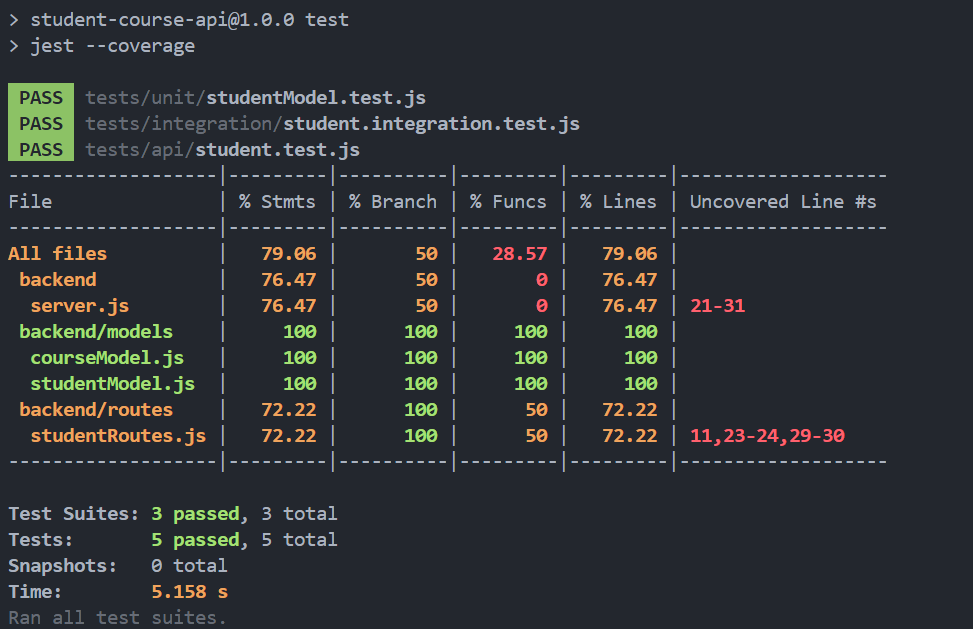

# Student-Course-API

A simple RESTful API for managing student records, built with Node.js, Express, and MongoDB. This project also includes an optional frontend for interacting with the API via a web form.

---

## 🔗 Live URLs

- **Backend API:** [https://student-course-api-vxk9.onrender.com/api/students](https://student-course-api-vxk9.onrender.com/api/students)

---

## 📂 Folder Structure

```bash
Student-Course-API/
├── backend/
│   ├── models/
│   │   ├── courseModel.js
│   │   └── studentModel.js
│   │
│   ├── routes/
│   │   │── studentRoutes.js
│   │   └── courseRoutes.js
│   │
│   ├── tests/                       
│   │   ├── api/
│   │   │   └── student.test.js      
│   │   ├── integration/
│   │   │   └── student.integration.test.js  
│   │   └── unit/
│   │       └── studentModel.test.js         
│   │
│   ├── .env                         
│   ├── .gitignore                 
│   ├── package.json                
│   └── server.js                                     
│
├── frontend/
│   └── index.html                  
│
└── README.md                                          
```

---

## 📌 API Endpoints and Functionality

| Method | Endpoint                      | Description                  |
|--------|-------------------------------|------------------------------|
| GET    | `/api/students`               | Fetch all student records    |
| POST   | `/api/students`               | Add a new student            |
| PUT    | `/api/students/:id`           | Update an existing student   |
| DELETE | `/api/students/:id`           | Delete a student by ID       |

---

## 🗃️ Database Integration

- **Database Used:** MongoDB Atlas (cloud-based)
- **Integration:** Connected via the official `mongoose` Node.js ODM.
- **URI Configuration:** Stored in `.env` as `MONGO_URI`

Example integration in `server.js`:
```javascript
const mongoose = require("mongoose");
mongoose.connect(process.env.MONGO_URI, { useNewUrlParser: true, useUnifiedTopology: true });
```

---

## ⚙️ Running the Server Locally

### 1. Clone the Repository

```bash
git clone https://github.com/your-username/student-course-api.git
cd student-course-api/backend
```

### 2. Create .env File

```env
PORT=10000
MONGO_URI=mongodb+srv://<username>:<password>@cluster0.mongodb.net/studentdb?retryWrites=true&w=majority
```

### 3. Install Dependencies

```bash
npm install
```

### 4. Start the Server

```bash
node server.js
```

## 🌐 Running the Frontend Locally (Optional)

### 1. Navigate to the Frontend Folder

```bash
cd ../frontend
```

### 2. Open index.html in Browser

You can simply open the index.html file in your browser.
Ensure the API_URL in the <script> section is pointing to your live or local backend URL.

## 📬 Sample Requests and Responses

### ➕ POST /api/students

**Request Body:**

```json
{
  "name": "Ankit Bakshi",
  "email": "ankit@example.com"
}
```

**Response:**

```json
{
  "_id": "665ffcc1a3b85c5a6a0c7f55",
  "name": "Ankit Bakshi",
  "email": "ankit@example.com",
  "__v": 0
}
```

### 📥 GET /api/students

**Response:**

```json
[
  {
    "_id": "665ffcc1a3b85c5a6a0c7f55",
    "name": "Ankit Bakshi",
    "email": "ankit@example.com",
    "__v": 0
  }
]
```

## ✅ Technologies Used

- Node.js
- Express.js
- MongoDB Atlas
- Mongoose
- dotenv
- CORS

## 🧪 Testing (3 Types of Tests Written)

### ✅ 1. Unit Tests (`tests/unit/studentModel.test.js`)

- **What it does:** Tests the structure and behavior of the Mongoose `Student` model.
- **Checks:** Whether the model can be instantiated with required fields (`name`, `email`).
- **Why:** Ensures schema logic works before any DB or API logic is tested.

### ✅ 2. Integration Tests (`tests/integration/student.integration.test.js`)

- **What it does:** Uses `mongodb-memory-server` to test database interaction without touching the real DB.
- **Checks:**
    - Saving a student to the database
    - Retrieving a student from the database
- **Why:** Validates that Mongoose and MongoDB work as expected together.

### ✅ 3. API Tests (`tests/api/student.test.js`)

- **What it does:** Tests actual API endpoints via HTTP requests using `Supertest`.
- **Checks:**
    - `GET /api/students` returns all students
    - `POST /api/students` creates a new student
    - Error handling for invalid requests (e.g., missing fields)
- **Why:** Ensures your external API is functioning correctly and returns expected HTTP responses.

---

## 📦 Run All Tests

```bash
npm test
```

## 📈 Run with Coverage Report

```bash
npm test -- --coverage
```

---

## 📊 Test Coverage Report 



---

## 📬 Contact
Made by **Ankit Bakshi**
- **Email:** [bakshiankit1005@gmail.com](bakshiankit1005@gmail.com)
- **GitHub:** @ankitbakshi10

